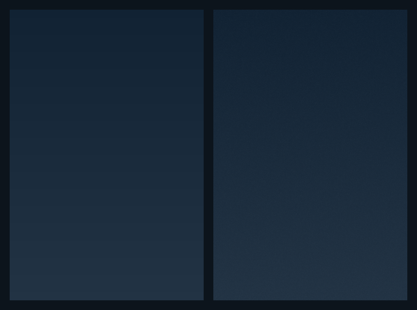

# js-noisy-gradient
Small and fast lib for smoothing visible banding in linear-gradient backgrounds.

## Intro ##

Gradient fills that use colors that are close to each other are prone
to producing a visual artefact called [color banding](https://en.wikipedia.org/wiki/Colour_banding).

For example, vertical `linear-gradient` from #112233 to #223344 looks like this:

Depending on your monitor and the lighting conditions the effect may be pronounced or just barely visible. 
Here's the same image with luminosity levels adjusted to exaggerate the effect:

Banding is certainly not an Earth-shattering issue, but when it's noticeable,
it tends to stick out and detract the attention from the rest of the design.

## Solution ##

There is however a very simple solution. It works by adding a small amount
of noise to the image, so that _some_ pixels become a little bit lighter
and some - a little bit darker.

By varying the amount of noise and the strength of lightening/darkening
it is possible to _blend_ bands together, albeit at the expense of adding
a bit of a texture.

Or, again, with the exaggeration to show the details:

And, finally, "raw" and "smoothed" versions side by side:

## The code ##

`NoisyVerticalGradient()` accepts image dimensions, a set of gradient 
stops and optinal options, and produces an image filled with a 
smoothed gradient as per above.

Caveats:
* Gradient stops are solid colors, specified in `#rrggbb` format.
* Gradient stops are assumed to spaced evenly.
* The gradient is vertical, as per the function name.
* The IE is not supported.

Pixels from the raw gradient fill are lightened up or dimmed by overlaying
either pure white or pure black pixels with random alpha transparency.

The usage:

    var nvg = new NoisyVerticalGradient(50, 400, [ '#112233', '#223344'] );
    var png = nvg.render_png();
    document.getElementById('xyz').style.backgroundImage = png;

This can obviously be simplified with some code to automatically
extract `width`, 'height` and `stops` arguments from the DOM/CSS
of a target element.

Options:

* `cover` - the percentage of pixels that gets their color tweaked. The default is 1.0, which is "all pixels".
* `black` - the maximum alpha of pure black pixels. The default is 0.03.
* `white` - the maximum alpha of pure white pixels. The default is 0.015.

So something like this will introduce an overly strong black-only
noise to about 30% of the image:

    var nvg = new NoisyVerticalGradient(..., { cover: 0.3, black: 1.0, white: 0.0 });

### WebGL ###

Adding noise to an image is not really a rocket science, but the 
trick is how to do it **fast**.

Here it's done with WebGL, which is probably one of more esoteric
uses of this lovely framework.

In fact, this is probably what makes the whole thing notable.

If you ever wondered how to apply WebGL in a purely *aesthetic*
capacity, this is **the** example of that.

### 2D canvas ###

There's also a pure `2D canvas` version, but be advised that it
can be *very* slow even on very fast machines. Literally, it will
take seconds to run for an image that's not even a full screen.

For that reason the fallback to the 2d_canvas rendering in case
when WebGL is not available is OFF by default.

You can switch it on by setting `canvas_fallback` to `true` in 
the `opts` argument of `NoisyVerticalGradient`.

## Live example ##

This code was written for the recent redesign of 
[Bvckup 2 homepage](https://bvckup2.com) which makes a good use 
of very dark gradients that showed a fair amount of banding with 
the plain `linear-gradient`.

Could've just photoshopped the noise on a background strip, but
where's fun in that? :)
